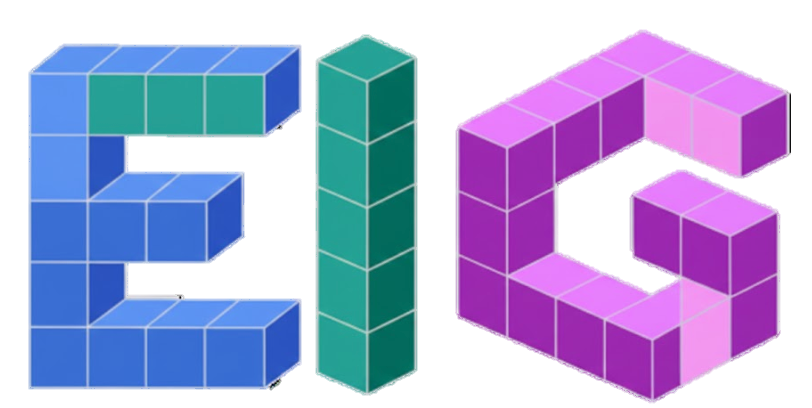

# Differentiable Generalized Eigenvalue Decomposition (eigh)



Standalone implementation of differentiable eigenvalue decomposition with CPU (LAPACK) and GPU (cuSOLVER) backends. Extracted from [pyscfad](https://github.com/fishjojo/pyscfad).

## Features
- **Generalized Problems**: `A @ V = B @ V @ diag(W)`, etc.
- **JAX Integrated**: Full support for `jit`, `vmap`, `grad`, and `jvp`.
- **High Performance**: Optimized LAPACK (CPU) and cuSOLVER (GPU) kernels.
- **Precision**: `float32/64` and `complex64/128`.
- **Degeneracy Handling**: Configurable `deg_thresh` for stable gradients.

## Installation & Quick Start

```bash
# Install from source
pip install .

# For GPU support in this environment
pip install .[cuda-local]
```

### Usage Example
```python
import jax
import jax.numpy as jnp
from eigh import eigh

jax.config.update("jax_enable_x64", True)
A = jnp.array([[2., 1.], [1., 2.]])
w, v = eigh(A) # Standard
grad = jax.grad(lambda A: eigh(A)[0].sum())(A) # Differentiable
```

## API Reference
- **`eigh(a, b=None, *, lower=True, eigvals_only=False, type=1, deg_thresh=1e-9)`**
  Scipy-compatible interface. `type` supports 1: `A@v=B@v@λ`, 2: `A@B@v=v@λ`, 3: `B@A@v=v@λ`.
- **`eigh_gen(a, b, *, lower=True, itype=1, deg_thresh=1e-9)`**
  Lower-level generalized solver.

## Degenerate Eigenvalues & Gradients
Individual eigenvalue gradients are ill-defined for degenerate (repeated) eigenvalues. However, symmetric functions (like `sum`, `var`, `trace`) have stable gradients. The `deg_thresh` parameter (default `1e-9`) masks divisions by near-zero gaps to maintain stability.

## Development & Testing
- **Requirements**: CMake 3.18+, C++17, JAX, NumPy, LAPACK/CUDA.
- **Tests**:
  ```bash
  pytest tests/test_eigh.py     # Core functionality
  pytest tests/test_eigh_gen.py # Generalized itypes
  pytest tests/test_eigh_jit.py # JIT & vmap
  ```
- **GPU Setup**:
  ```bash
  source setup_gpu_env_clean.sh
  ./run_gpu.sh python example_simple.py
  ```

## License & Citation
Apache License 2.0. If used in research, please cite:
```bibtex
@software{pyscfad,
  author = {Zhang, Xing},
  title = {PySCFad: Automatic Differentiation for PySCF},
  url = {https://github.com/fishjojo/pyscfad},
  year = {2021-2025}
}
```
